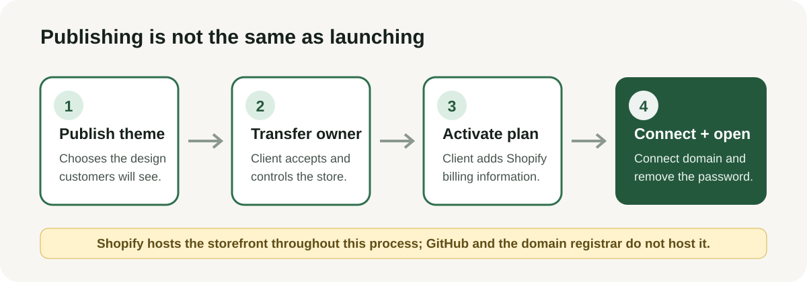
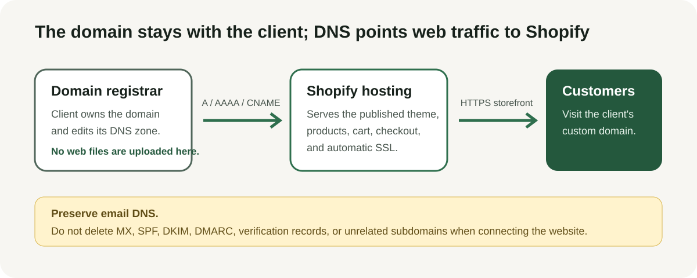

# Domain, Hosting, and Ownership Transfer Guide

Last reviewed: September 1, 2026

The INDEPENDENCE PHONE storefront is a Shopify theme. Moving administration to the client's accounts does not require rebuilding or self-hosting the storefront.

## What the Publish button does

The **Publish** button under **Online Store → Themes** only selects which Shopify theme customers will see. It does not upload the storefront to GitHub, the domain registrar, or a separate web host. Shopify already hosts the theme, products, cart, checkout, and SSL.

Only one theme can be published at a time. Publishing a draft moves the previously published theme into **Draft themes**, so it remains available as a rollback copy.

For a client-transfer or development store, public launch requires all of the following:

1. The intended theme is published.
2. The current owner transfers store ownership to the client's named Shopify account.
3. The client accepts ownership and enters their own Shopify billing information for a paid plan.
4. The client's custom domain is connected and made primary.
5. The storefront password is removed.

Giving the client administrator access alone is not the same as transferring ownership. A user with the **Themes** permission can publish a theme, but the store owner controls the ownership transfer and other owner-only settings.

## Recommended ownership model

- Shopify continues hosting the storefront and checkout.
- The client becomes or remains Shopify store owner.
- The client owns the custom domain and DNS account.
- The client controls the branded Sender email and its DNS authentication.
- The client organization owns or has administrator access to the GitHub repository.
- The client owns the hosting account for any future Rev.io, CRM, webhook, or other server-side integration.
- Developers use named Shopify collaborator/user access and named GitHub access, not shared passwords.

If “move this to their own hosted website” means leaving Shopify completely, that is a new migration project. A Shopify theme cannot simply be copied to generic web hosting and retain Shopify products, cart, checkout, Admin, or Theme Editor behavior.

## Connect the client's domain to Shopify

Connecting is normally the lowest-risk option because the domain stays with its current registrar while DNS points the storefront to Shopify.

1. Confirm who owns the registrar account and who can edit DNS.
2. Export or screenshot the current DNS zone, including email records.
3. In Shopify Admin, open **Settings → Domains → Connect existing domain** and enter the root domain without `www`.
4. At the current DNS provider, follow the exact records Shopify displays. Shopify's standard records are shown below; use Shopify's displayed value if it differs.
5. Remove only conflicting website records for the same host. Do not delete MX, DKIM, SPF, DMARC, verification, or unrelated subdomain records.
6. Return to **Settings → Domains** and ask Shopify to verify the connection.
7. Wait for the domain connection and Shopify-managed SSL certificate to complete. DNS propagation can take up to 48 hours.
8. Set the intended custom domain as the **Primary domain**. Other connected storefront domains should redirect to it.
9. Under **Online Store → Preferences**, remove password protection after the ownership transfer and paid-plan activation are complete.
10. Verify homepage, Order Now, cart, FAQ, Contact, policies, and checkout on the custom domain using a private browser window.

### Standard DNS records for the full domain

| Record | Host/name | Target/value | Purpose |
| --- | --- | --- | --- |
| `A` | `@` | `23.227.38.65` | Routes the root domain to Shopify over IPv4. |
| `AAAA` | `@` | `2620:0127:f00f:5::` | Routes the root domain to Shopify over IPv6. |
| `CNAME` | `www` | `shops.myshopify.com` | Routes the `www` hostname to Shopify. |

Use the DNS provider's default TTL. There should not be competing `A` or `AAAA` records for `@`, or a competing `CNAME` for `www`.

Shopify can request a smaller or region-specific set of records. Treat the live **Settings → Domains** card as authoritative for this store. For example, the current `independencephone.com` setup card requests these two changes:

| Record | Name | Replace | With |
| --- | --- | --- | --- |
| `A` | `@` | `207.246.255.73` | `23.227.38.65` |
| `CNAME` | `www` | `independencephone.com` | `shops.myshopify.com` |

That `A`-record change is the actual website cutover: it stops sending the root domain to the server at `207.246.255.73` and starts sending it to Shopify. Make that change only when Shopify is intended to replace the website currently served at the root domain. Preserve every unrelated email and verification record.

After saving both changes at the DNS provider, return to Shopify and click **I updated DNS records**. Shopify then checks propagation and provisions the TLS certificate. Do not click the button as a substitute for changing the records at the DNS provider.

### If the root domain already hosts another website

Do not point `@` to Shopify unless the client intends Shopify to replace that website. To keep the existing website and place the store at a subdomain such as `shop.example.com`:

1. Add a `CNAME` record for `shop` pointing to `shops.myshopify.com`.
2. Connect `shop.example.com` under **Settings → Domains** in Shopify.
3. Complete any TXT ownership verification Shopify requests.
4. Make the subdomain primary only if customers should see it as the storefront address.

Shopify recommends connecting first when uncertain. Registrar transfer can happen later and can take longer.

## Transfer the Shopify store to the client

Only the current store owner can change or transfer ownership.

Before transfer:

- Confirm inventory, orders, theme, notifications, domains, and billing are current.
- Export any financial, billing, payout, and order records the current owner must retain.
- Add the new owner as a user when using the existing-user ownership path.
- Update store contact, billing, payout, tax, domain, app, and third-party provider information to client-controlled details.
- Inventory all apps and external contracts, including Rev.io and any separately hosted integration.
- Confirm who will pay outstanding Shopify and app charges.

Then use Shopify's current ownership workflow under **Settings → Users** for an existing user or **Settings → General** for a transfer outside the business. The recipient must accept the transfer. After acceptance, review every user's permissions and remove obsolete access.

For a Shopify Partner client-transfer store, start the ownership change from the Partner/Dev Dashboard. The client must already exist as a user in the store, and the current owner must initiate the transfer. The client then supplies the billing information used for the Shopify subscription, themes, domains, and apps.

## Transfer GitHub administration

1. Create or select a client-owned GitHub organization or repository.
2. Add at least two client-controlled administrators when possible.
3. Transfer the repository or mirror it to the approved client location.
4. Confirm `main` contains the current README, guides, and only one canonical theme directory: `independence-phone-theme/`.
5. Reconfigure branch protection, deploy keys, Actions secrets, webhooks, and integrations in the client-owned location.
6. Clone the transferred repository into a clean directory and run the documented checks.
7. Remove old users and credentials only after the client proves access and a rollback copy exists.

GitHub is the version history for the live theme snapshot; it does not host the Shopify storefront and a Git push does not publish a Shopify theme.

## Transfer the server-side hosting

This repository does not include a hosted backend. If a future `/revio`, `/crm`, webhook, or similar server route is built, it is separate from Shopify theme hosting:

1. Create the production project in the client's hosting account.
2. Move source code through Git, not by copying secrets.
3. Re-enter secrets in the client's encrypted secret manager.
4. Configure the custom subdomain and TLS.
5. Restrict allowed origins and validate Shopify/App Proxy signatures as applicable.
6. Test health, authentication rejection, signed Shopify evidence, Rev.io sandbox behavior, logs, backups, and alerts.
7. Switch DNS or endpoint settings only after the client-owned deployment passes.
8. Keep the previous deployment available for rollback until production proof is complete.
9. Rotate old credentials and remove the previous account's access after cutover.

## Handoff acceptance checklist

- Client can sign in as Shopify store owner.
- A client-paid Shopify plan is active; the store is no longer limited to development access.
- Client controls billing, payouts, tax settings, users, domains, and notifications.
- Custom domain resolves securely and email DNS still works.
- The intended theme is published and the storefront password is removed.
- Client can administer the GitHub repository and clone it.
- GitHub contains the same deployable theme files as the live Shopify theme.
- Client controls Rev.io, gateway, hosting, logs, alerts, and secrets.
- An approved test proves storefront → payment → Rev.io → fulfillment/reconciliation, or the handoff explicitly records which integration remains incomplete.
- Rollback owners and steps are written down.
- Agency/developer access is reduced to the approved continuing role.

## Official references

- [Connect versus transfer a domain to Shopify](https://help.shopify.com/en/manual/domains/add-a-domain/connecting-domains/connect-vs-transfer)
- [Connect a third-party domain manually](https://help.shopify.com/en/manual/domains/add-a-domain/connecting-domains/connect-domain-manual)
- [Connect a third-party subdomain](https://help.shopify.com/en/manual/domains/add-a-domain/connecting-domains/connect-subdomain)
- [Publish Shopify themes](https://help.shopify.com/en/manual/online-store/themes/managing-themes/publishing-themes)
- [Transfer a development store to a client](https://help.shopify.com/partners/manage-clients-stores/development-stores/hand-off-development-stores)
- [Change or transfer Shopify ownership](https://help.shopify.com/en/manual/your-account/manage-orgs-and-stores/change-transfer-ownership)
- [Manage Shopify users](https://help.shopify.com/en/manual/your-account/users)
